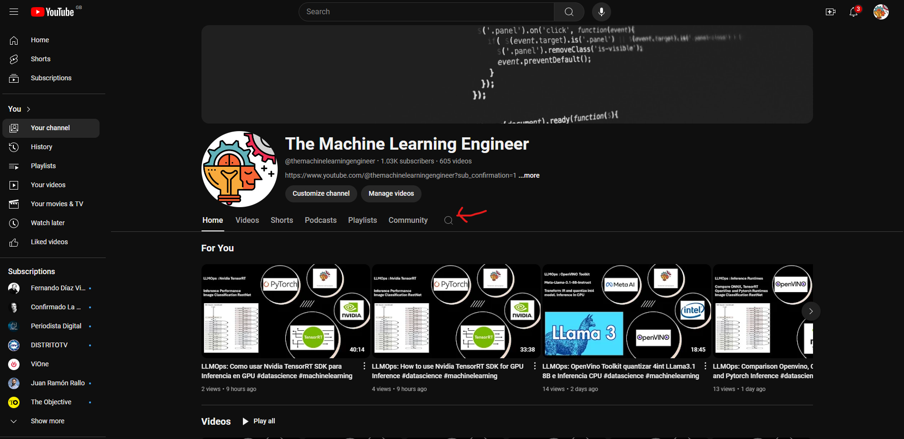
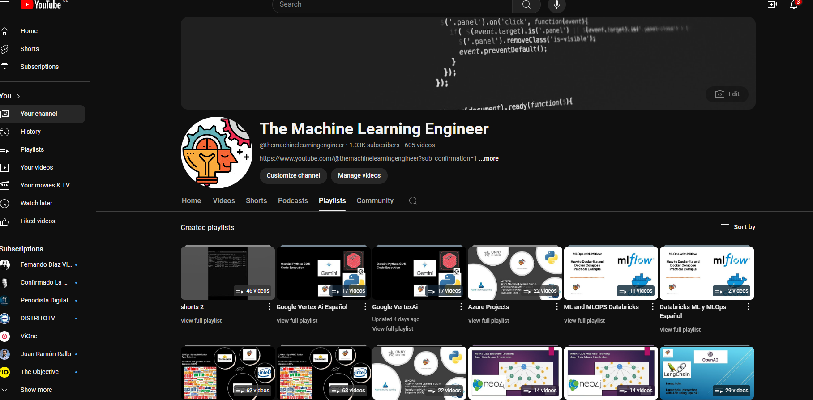

# LLM_Notebooks

This Repository contains all material supporting the Videos in my YouTube channel The Machine Learning Engineer https://www.youtube.com/channel/UCqAi1lTsd2wj7p05-Oos4ug

Look to the Playlist bellow to understand which kind of Material we have on the channel and here.
Note. I dont Attend issues i github. Please connect in youtube

The best way to find some information it is look for in the channel for a topic. There, if something matches what you are looking for, watch the video, and each of them contains a link to this repository on the description of the Video. Per Video I explain something, and we follow a Notebook or Code in VSCode. Python and C#, but mostly Python.
Videos are in English and Spanish. Each Video has the counterpart in the other Language, I think it is easy to differentiate just looking at the Title of the Video
Videos are classified in Playlists per topics, and each topic is very general. A video can fall in a couple of topics. 
Playlists are also organized in languages Spanish and English.
Shorts usually refer to a Video where it is described the complete topic. You can find the complete topic on the Section Related Video of the Short.

I upload Videos almost every day and the best way to solve a doubt or an issue it is to comment in the video. I try to answer as soon as I can. This I am doing a part of my job.

I will appreciate if you subscribe to the channel
https://www.youtube.com/@themachinelearningengineer?sub_confirmation=1
and like the videos and made constructive comments. Non-Constructive or unpolite comments are not answers and you can be banned.

Also, if you are don’t find something, let me know in a comment in YouTube and I will point you out to the video and Notebook or Code if I have it or something that may help you.

# Playlist

- Generative AI, LLM,s, Transformers, CV, NLP and more
- MLOps
- ML projects
- Azure Projects
- Google VertexAi
- ML Tricks
- Shorts and Shorts2
- Langchain
- LlamaIndex
- RAG Retrieval Augmented Generation
- Neo4J Data Science
- ML and MLOPS Databricks
- Raspberry Pi 

