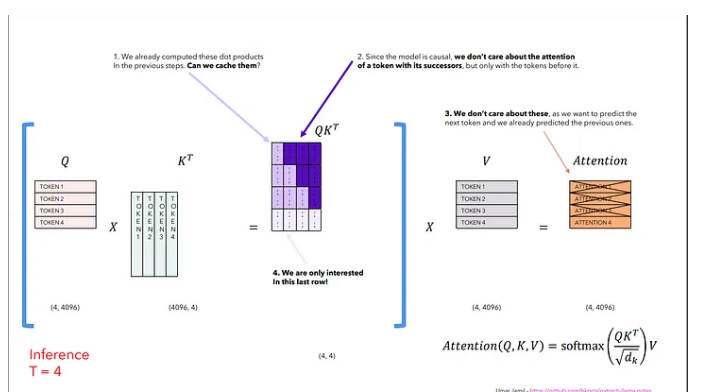
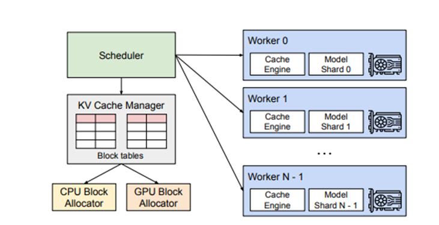

# vLLM 

is a library/framework designed to streamline the deployment, management, and serving of large language models (LLMs).
It is optimized for inference performance and scalability, making it suitable for production environments where efficient handling of multiple requests is critical.




# Comparision
*vLLM*

Pros:

- Highly optimized for inference performance.

- Supports distributed serving, allowing it to scale with the workload.

- Offers flexibility in configuration and deployment options.

Cons:

- Requires a bit more setup and understanding of the underlying architecture.

- Not as user-friendly for beginners compared to some other solutions.

*Ollama*

Pros:

- User-friendly and easy to set up.

- Great for quick experimentation and prototyping.

- Integrated with popular machine learning frameworks.

Cons:

- May not be as optimized for large-scale deployment.

- Limited in terms of scalability compared to vLLM.


# Langchain

LangChain is a framework for developing applications powered by language models. It provides tools and abstractions for building sophisticated AI applications, allowing you to focus on the high-level logic.
https://python.langchain.com/docs/integrations/chat/vllm/


# Installation
https://docs.vllm.ai/en/latest/getting_started/installation/gpu/index.html

- wget <model-url> -P /path/to/models/
- pip install vllm langchain langchain-openai
- python -m vllm.entrypoints.openai.api_server --model /path/to/models/meta-llama/Llama-3.1-8B-Instruct

 Arguments:
```md
usage: vllm serve [-h] [--model MODEL]
                  [--task {auto,generate,embedding,embed,classify,score,reward,transcription}]
                  [--tokenizer TOKENIZER] [--hf-config-path HF_CONFIG_PATH]
                  [--skip-tokenizer-init] [--revision REVISION]
                  [--code-revision CODE_REVISION]
                  [--tokenizer-revision TOKENIZER_REVISION]
                  [--tokenizer-mode {auto,slow,mistral,custom}]
                  [--trust-remote-code]
                  [--allowed-local-media-path ALLOWED_LOCAL_MEDIA_PATH]
                  [--download-dir DOWNLOAD_DIR]
                  [--load-format {auto,pt,safetensors,npcache,dummy,tensorizer,sharded_state,gguf,bitsandbytes,mistral,runai_streamer}]
                  [--config-format {auto,hf,mistral}]
                  [--dtype {auto,half,float16,bfloat16,float,float32}]
                  [--kv-cache-dtype {auto,fp8,fp8_e5m2,fp8_e4m3}]
                  [--max-model-len MAX_MODEL_LEN]
                  [--guided-decoding-backend GUIDED_DECODING_BACKEND]
                  [--logits-processor-pattern LOGITS_PROCESSOR_PATTERN]
                  [--model-impl {auto,vllm,transformers}]
                  [--distributed-executor-backend {ray,mp,uni,external_launcher}]
                  [--pipeline-parallel-size PIPELINE_PARALLEL_SIZE]
                  [--tensor-parallel-size TENSOR_PARALLEL_SIZE]
                  [--max-parallel-loading-workers MAX_PARALLEL_LOADING_WORKERS]
                  [--ray-workers-use-nsight] [--block-size {8,16,32,64,128}]
                  [--enable-prefix-caching | --no-enable-prefix-caching]
                  [--disable-sliding-window] [--use-v2-block-manager]
                  [--num-lookahead-slots NUM_LOOKAHEAD_SLOTS] [--seed SEED]
                  [--swap-space SWAP_SPACE] [--cpu-offload-gb CPU_OFFLOAD_GB]
                  [--gpu-memory-utilization GPU_MEMORY_UTILIZATION]
                  [--num-gpu-blocks-override NUM_GPU_BLOCKS_OVERRIDE]
                  [--max-num-batched-tokens MAX_NUM_BATCHED_TOKENS]
                  [--max-num-partial-prefills MAX_NUM_PARTIAL_PREFILLS]
                  [--max-long-partial-prefills MAX_LONG_PARTIAL_PREFILLS]
                  [--long-prefill-token-threshold LONG_PREFILL_TOKEN_THRESHOLD]
                  [--max-num-seqs MAX_NUM_SEQS] [--max-logprobs MAX_LOGPROBS]
                  [--disable-log-stats]
                  [--quantization {aqlm,awq,deepspeedfp,tpu_int8,fp8,ptpc_fp8,fbgemm_fp8,modelopt,marlin,gguf,gptq_marlin_24,gptq_marlin,awq_marlin,gptq,compressed-tensors,bitsandbytes,qqq,hqq,experts_int8,neuron_quant,ipex,quark,moe_wna16,None}]
                  [--rope-scaling ROPE_SCALING] [--rope-theta ROPE_THETA]
                  [--hf-overrides HF_OVERRIDES] [--enforce-eager]
                  [--max-seq-len-to-capture MAX_SEQ_LEN_TO_CAPTURE]
                  [--disable-custom-all-reduce]
                  [--tokenizer-pool-size TOKENIZER_POOL_SIZE]
                  [--tokenizer-pool-type TOKENIZER_POOL_TYPE]
                  [--tokenizer-pool-extra-config TOKENIZER_POOL_EXTRA_CONFIG]
                  [--limit-mm-per-prompt LIMIT_MM_PER_PROMPT]
                  [--mm-processor-kwargs MM_PROCESSOR_KWARGS]
                  [--disable-mm-preprocessor-cache] [--enable-lora]
                  [--enable-lora-bias] [--max-loras MAX_LORAS]
                  [--max-lora-rank MAX_LORA_RANK]
                  [--lora-extra-vocab-size LORA_EXTRA_VOCAB_SIZE]
                  [--lora-dtype {auto,float16,bfloat16}]
                  [--long-lora-scaling-factors LONG_LORA_SCALING_FACTORS]
                  [--max-cpu-loras MAX_CPU_LORAS] [--fully-sharded-loras]
                  [--enable-prompt-adapter]
                  [--max-prompt-adapters MAX_PROMPT_ADAPTERS]
                  [--max-prompt-adapter-token MAX_PROMPT_ADAPTER_TOKEN]
                  [--device {auto,cuda,neuron,cpu,openvino,tpu,xpu,hpu}]
                  [--num-scheduler-steps NUM_SCHEDULER_STEPS]
                  [--multi-step-stream-outputs [MULTI_STEP_STREAM_OUTPUTS]]
                  [--scheduler-delay-factor SCHEDULER_DELAY_FACTOR]
                  [--enable-chunked-prefill [ENABLE_CHUNKED_PREFILL]]
                  [--speculative-model SPECULATIVE_MODEL]
                  [--speculative-model-quantization {aqlm,awq,deepspeedfp,tpu_int8,fp8,ptpc_fp8,fbgemm_fp8,modelopt,marlin,gguf,gptq_marlin_24,gptq_marlin,awq_marlin,gptq,compressed-tensors,bitsandbytes,qqq,hqq,experts_int8,neuron_quant,ipex,quark,moe_wna16,None}]
                  [--num-speculative-tokens NUM_SPECULATIVE_TOKENS]
                  [--speculative-disable-mqa-scorer]
                  [--speculative-draft-tensor-parallel-size SPECULATIVE_DRAFT_TENSOR_PARALLEL_SIZE]
                  [--speculative-max-model-len SPECULATIVE_MAX_MODEL_LEN]
                  [--speculative-disable-by-batch-size SPECULATIVE_DISABLE_BY_BATCH_SIZE]
                  [--ngram-prompt-lookup-max NGRAM_PROMPT_LOOKUP_MAX]
                  [--ngram-prompt-lookup-min NGRAM_PROMPT_LOOKUP_MIN]
                  [--spec-decoding-acceptance-method {rejection_sampler,typical_acceptance_sampler}]
                  [--typical-acceptance-sampler-posterior-threshold TYPICAL_ACCEPTANCE_SAMPLER_POSTERIOR_THRESHOLD]
                  [--typical-acceptance-sampler-posterior-alpha TYPICAL_ACCEPTANCE_SAMPLER_POSTERIOR_ALPHA]
                  [--disable-logprobs-during-spec-decoding [DISABLE_LOGPROBS_DURING_SPEC_DECODING]]
                  [--model-loader-extra-config MODEL_LOADER_EXTRA_CONFIG]
                  [--ignore-patterns IGNORE_PATTERNS]
                  [--preemption-mode PREEMPTION_MODE]
                  [--served-model-name SERVED_MODEL_NAME [SERVED_MODEL_NAME ...]]
                  [--qlora-adapter-name-or-path QLORA_ADAPTER_NAME_OR_PATH]
                  [--show-hidden-metrics-for-version SHOW_HIDDEN_METRICS_FOR_VERSION]
                  [--otlp-traces-endpoint OTLP_TRACES_ENDPOINT]
                  [--collect-detailed-traces COLLECT_DETAILED_TRACES]
                  [--disable-async-output-proc]
                  [--scheduling-policy {fcfs,priority}]
                  [--scheduler-cls SCHEDULER_CLS]
                  [--override-neuron-config OVERRIDE_NEURON_CONFIG]
                  [--override-pooler-config OVERRIDE_POOLER_CONFIG]
                  [--compilation-config COMPILATION_CONFIG]
                  [--kv-transfer-config KV_TRANSFER_CONFIG]
                  [--worker-cls WORKER_CLS]
                  [--generation-config GENERATION_CONFIG]
                  [--override-generation-config OVERRIDE_GENERATION_CONFIG]
                  [--enable-sleep-mode] [--calculate-kv-scales]
                  [--additional-config ADDITIONAL_CONFIG]
```

```python 

from vllm import LLM, SamplingParams

# Define a conversation scenario.
conversation = [
    {"role": "system", "content": "You are a helpful assistant"},
    {"role": "user", "content": "Hello"},
    {"role": "assistant", "content": "Hello! How can I assist you today?"},
    {"role": "user", "content": "Write an essay about the importance of higher education."},
]

# Define sampling parameters for the model's response.
sampling_params = SamplingParams(temperature=0.8, top_p=0.95, max_tokens=512)

# Initialize the LLM with model and tokenizer paths, and specify parameters like max length and quantization.
llm = LLM(
    model="/mnt/Meta-Llama-3.1-8B-Instruct-GGUF/Meta-Llama-3.1-8B-Instruct-Q4_K_L.gguf",
    tokenizer="/mnt/models/Meta-Llama-3.1-8B-Instruct-GGUF",
    max_model_len=50000,
    quantization="int8",
    device="cuda",
)

# Generate responses from the model based on the provided conversation and sampling parameters.
outputs = llm.chat(conversation, sampling_params)

# Print each prompt and corresponding generated text.
for output in outputs:
    prompt = output.prompt
    generated_text = output.outputs[0].text
    print("\n")
    print(f"Prompt: {prompt!r}, Generated text: {generated_text!r}")
```

