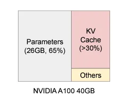
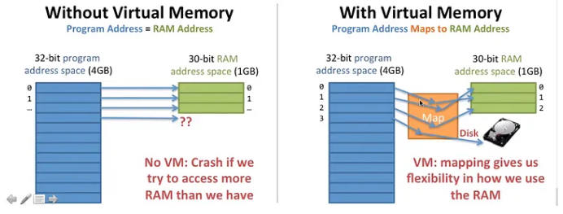

# vLLM 

is a library/framework designed to streamline the deployment, management, and serving of large language models (LLMs).
It is optimized for inference performance and scalability, making it suitable for production environments where efficient handling of multiple requests is critical.
https://arxiv.org/abs/2309.06180

# KV Cache


The Key and Value states are used for calculating the scaled dot-product attention. KV caching occurs during multiple token generation steps and only happens in the decoder.
Since the decoder is causal (i.e., the attention of a token only depends on its preceding tokens), at each generation step we are recalculating the same previous token attention, when we actually just want to calculate the attention for the new token.

This is where KV comes into play. By caching the previous Keys and Values, we can focus on only calculating the attention for the new token.


Why is this optimization important? As seen in the picture above, the matrices obtained with KV caching are way smaller, which leads to faster matrix multiplications. The only downside is that it needs more GPU VRAM (or CPU RAM if GPU is not being used) to cache the Key and Value states.

# Issues with KV Cache
- These KV caches are generally stored in a contiguous memory. If we have parallel multiple requests, then they need to be stored separately, which is a waste of memory and potentially leads to an OOM (Out of Memory) error.
-  The static model weights consume almost 65% of the VRAM memory and the KV cache consumes almost 30% as it grows in size with multiple requests and inefficient use of memory. And, if we are storing the KV cache in a contiguous memory, then it needs to be de-allocated after some serving to accommodate for the recent KV cache


- If we want to generate parallel multiple responses that share some initial response, then we need to store them separately in a contiguous memory for each response generated, which wastes a lot of space. Also, with advanced techniques like beam search, we pick the most likely tokens based on the future cumulative probabilities of tokens generated. Here we need to backtrack and kill some pathways, so for each direction that we go into in beam search, if we assign a new contiguous memory, then it will consume a lot of memory inefficiently
- The GPUs have gotten good at matrix multiplication, but the memory of these systems is still limited, hence memory-bound. The KV cache can help as it can help us to get the key and value matrices faster to do computation. But with limited memory, we need to come up with better memory management.
- Due to the sequential nature of the inferencing, we have to reserve memory (pre-allocation) for the KV cache as it needs to be in contiguous form. We can reserve it according to the maximum output sequence length like 2048. This can create a bottleneck and it is an efficient use of memory space. And if we generate a small response, we will be wasting the space.
- Here there are two types of fragmentation (i) Internal and (ii)External. Internal fragmentation is due to unused memory space as we are allocating more memory than is required. External fragmentation is due to the Buddy allocation algorithm (used in ORCA), here the maximum reserved pre-allocated space is in multiple powers of 2 (like 4, 8, 16, 32, etc), hence there may be some un-reserved spaces. In the buddy-allocation algorithm, the scheduler assigns the program to the least memory space in the power of 2 (if a response needs 4 tokens, then we need to allocate memory space of 4). But as we don’t know the output token length beforehand, it is inefficient.

# What Solve vLLM 
# Paged Attention

- As the transformer is auto-regressive, we need to come up with non-contiguous caching of Key and Value matrices, and we should efficiently allocate in GPU VRAM memory
- As the KV cache size grows with an increase in batch size for inference, we need to have non-contiguous memory allocation and intelligent allocation and de-allocation of cache memory
- Paged attention allows storing continuous keys and values in non-contiguous memory space. Instead of storing the KV matrices in a contiguous manner, it stores a block of KV matrices, where each block contains key and value vectors for a fixed number of tokens

# VIRTUAL MEMORY AND PAGING

- Without virtual memory, the program address space (where our code is trying to allocate space to functions and variables) will run out of address space in the RAM address space. But the virtual memory is more flexible as it DOES NOT need to map in a contiguous manner (a problem that we mentioned earlier) and we have the flexibility to map it back to the disk (in our inference pipeline, we can map it back to CPU if the GPU VRAM memory runs out of memory).

- We have a one-to-one mapping, where one program address space maps to one address space on the RAM. This will be intractable as the RAM space grows. Hence, we need a page table that maps many-to-many, where the map is from many addresses (4KB) in the program address space to many addresses (4KB) in the RAM address space and this will be tractable.

- Also, the program space is contiguous going from 0 →1 →2 →3, but the mapping to physical memory is non-contiguous as it can be mapped anywhere


# Comparision
*vLLM*

Pros:

- Highly optimized for inference performance.

- Supports distributed serving, allowing it to scale with the workload.

- Offers flexibility in configuration and deployment options.

Cons:

- Requires a bit more setup and understanding of the underlying architecture.

- Not as user-friendly for beginners compared to some other solutions.

*Ollama*

Pros:

- User-friendly and easy to set up.

- Great for quick experimentation and prototyping.

- Integrated with popular machine learning frameworks.

Cons:

- May not be as optimized for large-scale deployment.

- Limited in terms of scalability compared to vLLM.


# Langchain

LangChain is a framework for developing applications powered by language models. It provides tools and abstractions for building sophisticated AI applications, allowing you to focus on the high-level logic.
https://python.langchain.com/docs/integrations/chat/vllm/


# Installation
https://docs.vllm.ai/en/latest/getting_started/installation/gpu/index.html

- wget <model-url> -P /path/to/models/
- pip install vllm langchain langchain-openai
- vllm serve /mnt/..../models/Meta-Llama-3.1-8B-Instruct-GGUF/Meta-Llama-3.1-8B-Instruct-Q4_K_M.gguf --tokenizer /mnt/.../models/Meta-Llama-3.1-8B-Instruct-GGUF --max_model_len 10000 --dtype auto

 Arguments:
```md
usage: vllm serve [-h] [--model MODEL]
                  [--task {auto,generate,embedding,embed,classify,score,reward,transcription}]
                  [--tokenizer TOKENIZER] [--hf-config-path HF_CONFIG_PATH]
                  [--skip-tokenizer-init] [--revision REVISION]
                  [--code-revision CODE_REVISION]
                  [--tokenizer-revision TOKENIZER_REVISION]
                  [--tokenizer-mode {auto,slow,mistral,custom}]
                  [--trust-remote-code]
                  [--allowed-local-media-path ALLOWED_LOCAL_MEDIA_PATH]
                  [--download-dir DOWNLOAD_DIR]
                  [--load-format {auto,pt,safetensors,npcache,dummy,tensorizer,sharded_state,gguf,bitsandbytes,mistral,runai_streamer}]
                  [--config-format {auto,hf,mistral}]
                  [--dtype {auto,half,float16,bfloat16,float,float32}]
                  [--kv-cache-dtype {auto,fp8,fp8_e5m2,fp8_e4m3}]
                  [--max-model-len MAX_MODEL_LEN]
                  [--guided-decoding-backend GUIDED_DECODING_BACKEND]
                  [--logits-processor-pattern LOGITS_PROCESSOR_PATTERN]
                  [--model-impl {auto,vllm,transformers}]
                  [--distributed-executor-backend {ray,mp,uni,external_launcher}]
                  [--pipeline-parallel-size PIPELINE_PARALLEL_SIZE]
                  [--tensor-parallel-size TENSOR_PARALLEL_SIZE]
                  [--max-parallel-loading-workers MAX_PARALLEL_LOADING_WORKERS]
                  [--ray-workers-use-nsight] [--block-size {8,16,32,64,128}]
                  [--enable-prefix-caching | --no-enable-prefix-caching]
                  [--disable-sliding-window] [--use-v2-block-manager]
                  [--num-lookahead-slots NUM_LOOKAHEAD_SLOTS] [--seed SEED]
                  [--swap-space SWAP_SPACE] [--cpu-offload-gb CPU_OFFLOAD_GB]
                  [--gpu-memory-utilization GPU_MEMORY_UTILIZATION]
                  [--num-gpu-blocks-override NUM_GPU_BLOCKS_OVERRIDE]
                  [--max-num-batched-tokens MAX_NUM_BATCHED_TOKENS]
                  [--max-num-partial-prefills MAX_NUM_PARTIAL_PREFILLS]
                  [--max-long-partial-prefills MAX_LONG_PARTIAL_PREFILLS]
                  [--long-prefill-token-threshold LONG_PREFILL_TOKEN_THRESHOLD]
                  [--max-num-seqs MAX_NUM_SEQS] [--max-logprobs MAX_LOGPROBS]
                  [--disable-log-stats]
                  [--quantization {aqlm,awq,deepspeedfp,tpu_int8,fp8,ptpc_fp8,fbgemm_fp8,modelopt,marlin,gguf,gptq_marlin_24,gptq_marlin,awq_marlin,gptq,compressed-tensors,bitsandbytes,qqq,hqq,experts_int8,neuron_quant,ipex,quark,moe_wna16,None}]
                  [--rope-scaling ROPE_SCALING] [--rope-theta ROPE_THETA]
                  [--hf-overrides HF_OVERRIDES] [--enforce-eager]
                  [--max-seq-len-to-capture MAX_SEQ_LEN_TO_CAPTURE]
                  [--disable-custom-all-reduce]
                  [--tokenizer-pool-size TOKENIZER_POOL_SIZE]
                  [--tokenizer-pool-type TOKENIZER_POOL_TYPE]
                  [--tokenizer-pool-extra-config TOKENIZER_POOL_EXTRA_CONFIG]
                  [--limit-mm-per-prompt LIMIT_MM_PER_PROMPT]
                  [--mm-processor-kwargs MM_PROCESSOR_KWARGS]
                  [--disable-mm-preprocessor-cache] [--enable-lora]
                  [--enable-lora-bias] [--max-loras MAX_LORAS]
                  [--max-lora-rank MAX_LORA_RANK]
                  [--lora-extra-vocab-size LORA_EXTRA_VOCAB_SIZE]
                  [--lora-dtype {auto,float16,bfloat16}]
                  [--long-lora-scaling-factors LONG_LORA_SCALING_FACTORS]
                  [--max-cpu-loras MAX_CPU_LORAS] [--fully-sharded-loras]
                  [--enable-prompt-adapter]
                  [--max-prompt-adapters MAX_PROMPT_ADAPTERS]
                  [--max-prompt-adapter-token MAX_PROMPT_ADAPTER_TOKEN]
                  [--device {auto,cuda,neuron,cpu,openvino,tpu,xpu,hpu}]
                  [--num-scheduler-steps NUM_SCHEDULER_STEPS]
                  [--multi-step-stream-outputs [MULTI_STEP_STREAM_OUTPUTS]]
                  [--scheduler-delay-factor SCHEDULER_DELAY_FACTOR]
                  [--enable-chunked-prefill [ENABLE_CHUNKED_PREFILL]]
                  [--speculative-model SPECULATIVE_MODEL]
                  [--speculative-model-quantization {aqlm,awq,deepspeedfp,tpu_int8,fp8,ptpc_fp8,fbgemm_fp8,modelopt,marlin,gguf,gptq_marlin_24,gptq_marlin,awq_marlin,gptq,compressed-tensors,bitsandbytes,qqq,hqq,experts_int8,neuron_quant,ipex,quark,moe_wna16,None}]
                  [--num-speculative-tokens NUM_SPECULATIVE_TOKENS]
                  [--speculative-disable-mqa-scorer]
                  [--speculative-draft-tensor-parallel-size SPECULATIVE_DRAFT_TENSOR_PARALLEL_SIZE]
                  [--speculative-max-model-len SPECULATIVE_MAX_MODEL_LEN]
                  [--speculative-disable-by-batch-size SPECULATIVE_DISABLE_BY_BATCH_SIZE]
                  [--ngram-prompt-lookup-max NGRAM_PROMPT_LOOKUP_MAX]
                  [--ngram-prompt-lookup-min NGRAM_PROMPT_LOOKUP_MIN]
                  [--spec-decoding-acceptance-method {rejection_sampler,typical_acceptance_sampler}]
                  [--typical-acceptance-sampler-posterior-threshold TYPICAL_ACCEPTANCE_SAMPLER_POSTERIOR_THRESHOLD]
                  [--typical-acceptance-sampler-posterior-alpha TYPICAL_ACCEPTANCE_SAMPLER_POSTERIOR_ALPHA]
                  [--disable-logprobs-during-spec-decoding [DISABLE_LOGPROBS_DURING_SPEC_DECODING]]
                  [--model-loader-extra-config MODEL_LOADER_EXTRA_CONFIG]
                  [--ignore-patterns IGNORE_PATTERNS]
                  [--preemption-mode PREEMPTION_MODE]
                  [--served-model-name SERVED_MODEL_NAME [SERVED_MODEL_NAME ...]]
                  [--qlora-adapter-name-or-path QLORA_ADAPTER_NAME_OR_PATH]
                  [--show-hidden-metrics-for-version SHOW_HIDDEN_METRICS_FOR_VERSION]
                  [--otlp-traces-endpoint OTLP_TRACES_ENDPOINT]
                  [--collect-detailed-traces COLLECT_DETAILED_TRACES]
                  [--disable-async-output-proc]
                  [--scheduling-policy {fcfs,priority}]
                  [--scheduler-cls SCHEDULER_CLS]
                  [--override-neuron-config OVERRIDE_NEURON_CONFIG]
                  [--override-pooler-config OVERRIDE_POOLER_CONFIG]
                  [--compilation-config COMPILATION_CONFIG]
                  [--kv-transfer-config KV_TRANSFER_CONFIG]
                  [--worker-cls WORKER_CLS]
                  [--generation-config GENERATION_CONFIG]
                  [--override-generation-config OVERRIDE_GENERATION_CONFIG]
                  [--enable-sleep-mode] [--calculate-kv-scales]
                  [--additional-config ADDITIONAL_CONFIG]
```

```python 

from vllm import LLM, SamplingParams

# Define a conversation scenario.
conversation = [
    {"role": "system", "content": "You are a helpful assistant"},
    {"role": "user", "content": "Hello"},
    {"role": "assistant", "content": "Hello! How can I assist you today?"},
    {"role": "user", "content": "Write an essay about the importance of higher education."},
]

# Define sampling parameters for the model's response.
sampling_params = SamplingParams(temperature=0.8, top_p=0.95, max_tokens=512)

# Initialize the LLM with model and tokenizer paths, and specify parameters like max length and quantization.
llm = LLM(
    model="/mnt/Meta-Llama-3.1-8B-Instruct-GGUF/Meta-Llama-3.1-8B-Instruct-Q4_K_L.gguf",
    tokenizer="/mnt/models/Meta-Llama-3.1-8B-Instruct-GGUF",
    max_model_len=50000,
    quantization="int8",
    device="cuda",
)

# Generate responses from the model based on the provided conversation and sampling parameters.
outputs = llm.chat(conversation, sampling_params)

# Print each prompt and corresponding generated text.
for output in outputs:
    prompt = output.prompt
    generated_text = output.outputs[0].text
    print("\n")
    print(f"Prompt: {prompt!r}, Generated text: {generated_text!r}")
```

