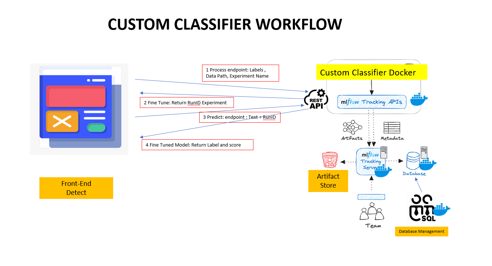

# CUSTOM CLASSIFIER

# Introduction 
This repository contains the Custom-Classifier components. The Custom-Classifier it is an application which allow the customer create a classifier using their own data and labels. User have to provide a set of documents organized in folders. Each folder represent a class or label and the folder contains a minumum of 100 documents which represent the class/label. Provide a correct set of documents organized correctly and a minimum size per class/label it is a responsability of the user. With this set of document we will fine tune a LLM on the task classification and if the classifier meet the evaluation criteria, it will be saved on the MLFLOW model repository of that user to later be use for inference. One you have 1 classifier or multiple classifier you can decide to classify a document using the specific set of labels that were use during the fine tuning. The minimum number of classes/labels is two.

# Components

All components of this application run in docker containers and have a common compose to build them up.
Main components of this application:

- Custom Classifier REST API
- MLflow Tracking Server / Artifact repository
- Database (Permanet storage Metadata)
- Admin Database
- NGINX

# Main Workflow application

 - The user using the UI send a request containing a list of labels a location folder and name for that job
 - Start an Experiment in MLFLOW and the process create a dataset with the documents in the location and train a LLM. One the process finish the model it is log in MLFLOW. The API return to the UI the information to localize the model(Uri pointing to model in model registry or artifact repository)
 - The user now can send a request to a model in an specific endpoint / location using the mlflow runID and a text
 - The endpoint return a class label and a score for that document

# Getting Started
The AI components are organized into different folders:

      Main Folders

      mlflow: MLflow tracking Server
      custom_classifier: classifier REST API.
      docker: Docker compose and nginx configuration.
      
1. Installation Process
   Mlflow and custom_classifier have a Dockerfile and a requirements.txt file to create the container. All component are include in a Docker-compose file to deploy the components to the prod env

2. Software Dependencies

   - Python 3.11.16
   - Files requirements.txt

3. Latest Releases
   N/A

4. API References
   N/A

# Build and Test

TODO

# Running Locally with Docker Compose

TODO

# PremCloud Development

To contribute to this repository, you need to have experience in Python, serverless applications using FastAPI, and a number of deep learning and machine learning technologies like PyTorch, spaCy, scikit-learn, HuggingFace Transformers, and OpenCV.

# Setup Development Environment

    - Install Visual Studio Code or PyCharm.
    - Install Anaconda. Example for Windows: Anaconda Installation Guide for Windows.
    - Clone the repository to your local machine: git clone https://dev.azure.com/sceven/DataDetect/_git/Detect-AI-Custom-Classifier.

    - Create a Conda environment from the environment.yml file (located at the root of our repository):
      - conda env create --file environment.yml
      - conda activate detect-ai
    - Launch Jupyter Notebook with the command: jupyter notebook inside the environment.

    - If you want to use Visual Studio Code, navigate to the root of the repo in a command line window, run conda activate detect-ai, and then code ..

# Endpoints / APIs

We use FastAPI, a web framework for building APIs with Python 3.9+ based on standard Python type hints. Documentation: FastAPI Documentation. https://fastapi.tiangolo.com/

